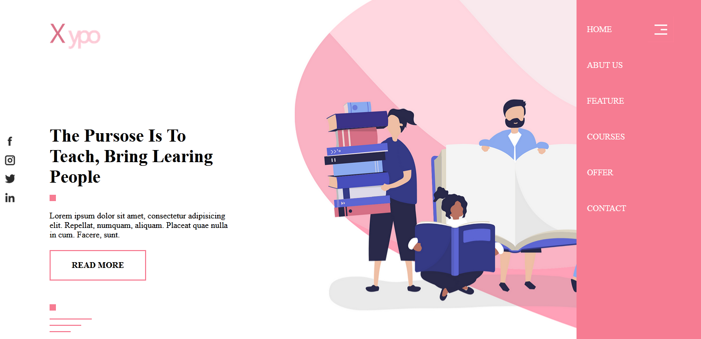
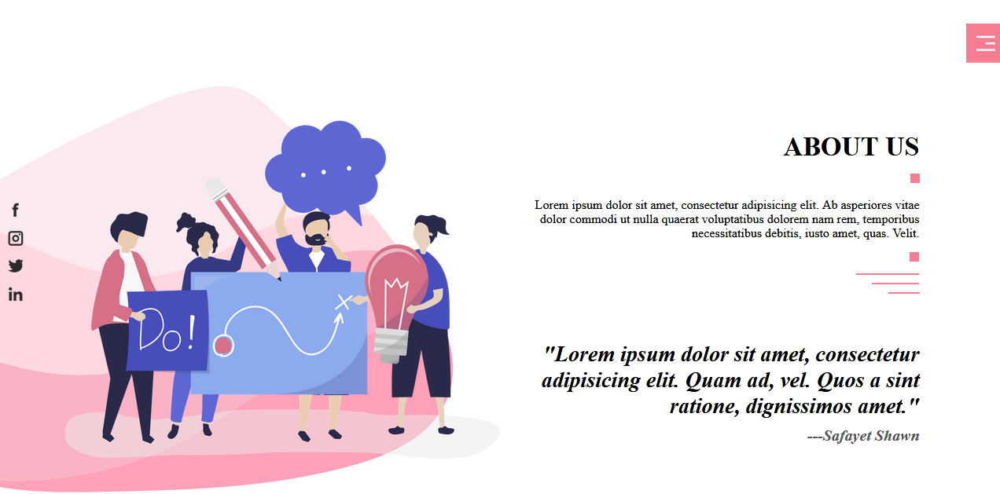
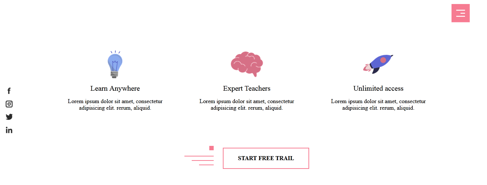
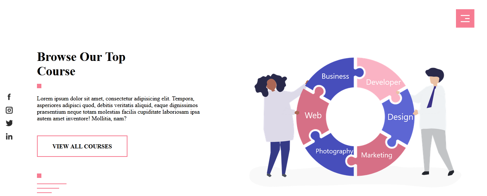
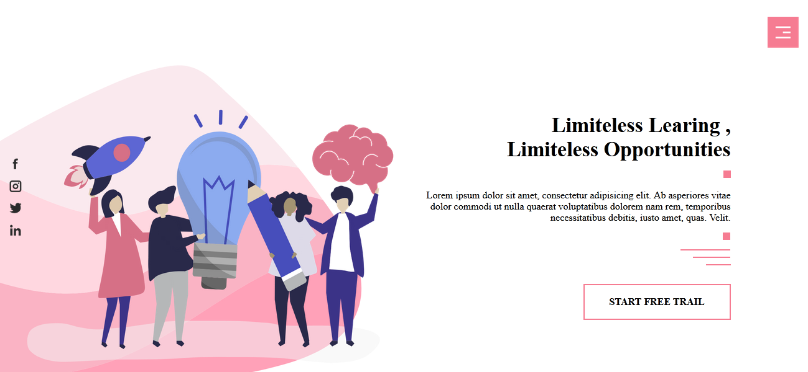
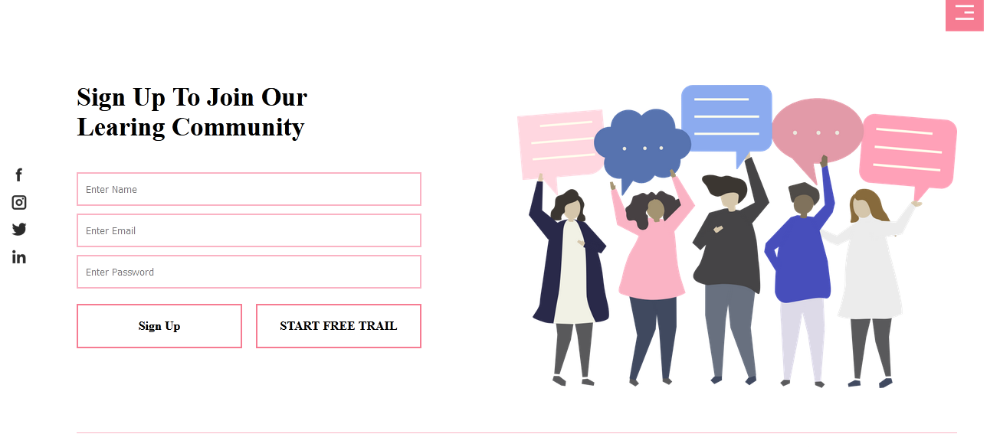
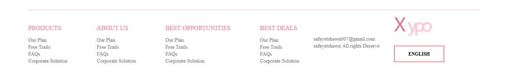

<h1 align="center">Responsive Landing page by Flexbox</h1>

Here i have Created a beautiful website design using flexbox ,it also includes sticky right side and left side sticky social section.It has total 7 section all of them are completely responsive

## Sections

-  Hero Srction
-  About Srction 
-  Service Section
-  Course Section
-  Opportunity Srction
-  Contact Srction
-  Footer Srction

# How to see the design

-  download files above and unzip 
-  Double click on .html extension file

# Contact & social

- **[Facebook](https://www.facebook.com/safahait.sawon)**
- **[Github](https://github.com/Safayet-Shawn/)**
- **[Gmail:safayetshawn95@gmail.com](safayetshawn95@gmail.com)**
- **[Phone :01726681903](01726681903)**
 
# Screenshots

